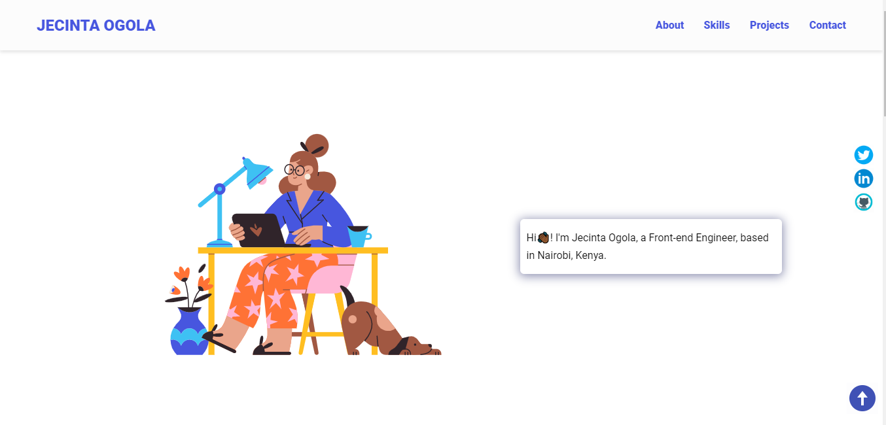

# MY PORTFOLIO

A portfolio website template to showcase my skills.

## Author

[@ogolajecinta](https://www.twitter.com/ogolajecinta)

## Sample Website

A live demo is already available via this [link](https://ogolajecinta.github.io/my-portfolio)

## Tech Stack

**Client:** HTML, CSS, Vanilla JavaSCript

## Tools Used

Below are are list of tools used, and the precise things they were used for:

- [Ion Icons](https://ionic.io/ionicons) for hambuger menu bar
- [Drawkit](https://www.drawkit.io/) for the illustration
- [Icon8](https://icons8.com/) for animated icons and skills icons
- [Animate CSS](https://animate.style/) for bio text animation
- [Formspree](https://formspree.io/) for contact form submision and straight delivery to Gmail

## Folder Structure

The index.html and readme files are in the root folder, alongside the screenshot included in the readme.

The assets folder contains the CSS and JavaScript files, all images and icons used, in their respective folders.

## Extra resources used

For the form submission, formspree was used. You can get a hands-on tutorial on how to use formspree by watching this [YouTube video](https://formspree.io/). Submissions will be delivered straight into the specified Gmail account.

In addition to formspree, you can also use Netlify form submission in case you deploy there. Brad Traversy has a [video tutorial](https://www.youtube.com/watch?v=6ElQ689HRcY) on how to do it.

## Acknowledgements

- [Awesome Readme Templates](https://awesomeopensource.com/project/elangosundar/awesome-README-templates)
- [Awesome README](https://github.com/matiassingers/awesome-readme)
- [How to write a Good readme](https://bulldogjob.com/news/449-how-to-write-a-good-readme-for-your-github-project)
